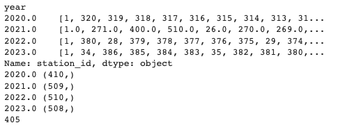
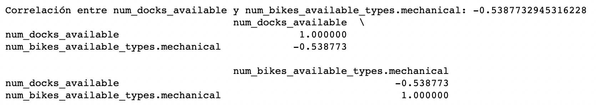
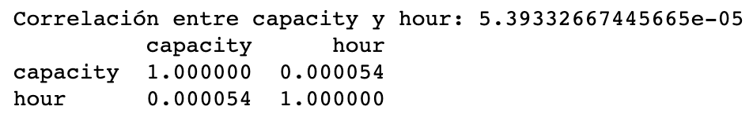

# CaptstoneProject

- Sandra Díaz
- Daniel Fares
- Oriol Soler

 

# 1. Introducción al problema
El reto propuesto para el proyecto Capstone consiste en predecir el porcentaje de sitios disponibles para aparcar las bicis de Bicing Barcelona por estación según sus datos históricos. Estos datos son recogidos y publicados mensualmente al portal Open Data del ayuntamiento de Barcelona, y contienen parametros relativos a cada estación y sus bicicletas.

Uno de los primeros problemas a afrontar es la gran cantidad de datos disponibles. Este hecho dificulta en gran medida las primeras etapas del proyecto dado que la obtención y primeros análisis de los datos llevan mucho tiempo y esfuerzo. Para conseguirlo, se usa Dask, una librería de Python que permite parallel computing.

Posteriormente, se procede a hacer un estudio detallado de cada dimensión, estudiar que correlaciones hay entre  las variables, limpiar los datasets, enriquecer los datos y procesarlos para crear modelos predictivos.

 

# 2. Data cleaning 
En primer lugar, se ha realizado un análisis inicial con el objetivo de limpiar los ficheros de datos que carecen de sentido por algún motivo. Para ello, se han realizado los siguientes pasos:
- Descarga de los datos de la página web oficial para los años 2019, 2020, 2021, 2022 y 2023 (incluyendo los datos no incorporados en la descarga inicial).
- Cálculo de los valores faltantes (NaN) para las distintas variables de los datasets.
- Cálculo de los valores que se corresponden con 0 de las distintas variables de los datasets.
- Clasificación de las variables según si son categóricas o numéricas, así como el cálculo de valores únicos que devuelve cada una de ellas. 
- Eliminación de elementos duplicados de las variables en las que no tienen sentido, como por ejemplo el ‘last_reported’.
- Eliminación de columnas que no son necesarias: 'last_updated', 'ttl', 'is_installed', 'status', 'is_charging_station', 'is_returning', y 'is_renting'.post_code.
- Ajuste variable ‘status’, agrupando bajo el valor 0 ‘in_service’ y bajo 1, ‘closed’.
- Crear nuevas columnas para el ‘last_reported’ y el ‘last_updated’, asignando nuevas variables a los valores devueltos.
- Uniformar el formato de los timestamp a fecha/hora.
- Incorporación de la variable ctx0, que relaciona los anclajes disponibles (num_docs_available) entre la capacidad (capacity), es decir, el número máximo de anclajes por estación. Adicionalmente, se incluyen también ctx1, ctx2, ctx3 y ctx4, que hacen referencia a la disponibilidad porcentual de bicicletas la hora anterior, las dos horas anteriores... y así sucesivamente.
- Agrupar el timestamp en múltiplos de 60 para poder reducir la base de datos trabajada, ya que nos interesaba tener los datos en granularidad por hora en vez de minuto.
- Generación de valores medios de las ultimas 2, 3 y 4 horas para asignar el valor más representativo a cada registro de timestamp agrupado por hora.

 

# 3. Data analysis

## 3.1. Descriptiva

### 3.1.1. Evolución del uso de las bicicletas a lo largo de los años
A excepción del 2020, la tendencia del uso de las bicicletas en Barcelona a través del servicio del Bicing es creciente. Sin embargo, dicha subida se ve mermada en el propio 2020 a causa del Covid, una pandemia mundial que conllevó una cuarentena general de la población en España y que, consecuentemente, afectó a su vez a la capital catalana.

 

 

Aún así, la diferencia entre 2019 y 2020, por lógica, debería ser mayor. Dado que el 2019 no estaba completo en el dataset inicial, se procede a completarlo manualmente con la descarga de los datos restantes de un segundo dataset. Esto podría explicar la falta de coherencia en términos de volumen de ese año.

 

 

### 3.1.2. Station_ID
En primer lugar, se han analizado los IDs de estaciones a lo largo de los años, para verificar si variaban en términos de volumen.

 

 

Se ha percibido que no todos los IDs son constantes a lo largo de los años, y es por eso que se localizan los IDs únicos que están presentes en todos los años, encontrando un total de 405. 

 

 

### 3.1.3. Anclajes disponibles (num_docks_available)
La variable num_docks_available indica la cantidad de anclajes disponibles que hay en cada estación de Bicing en cada momento. Este indicador es clave a lo largo del estudio ya que la predición se basa en la ratio entre bicis disponibles (variable directamente relacionada con los sitios vacios) sobre el total.

Será necesario tener en cuenta que el valor de esta variable no puede valorarse de manera independiente, ya que las diferentes estaciones que hay en la ciudad no tienen el mismo tamaño, y por esto se trabajará con las ratios en vez de los valores absolutos. Aún así, no está de más observar la frequencia de sitios disponibles por estación.

### 3.1.4. Bicicletas disponibles
Existen dos tipos de bicicletas en Bicing Barcelona: las mecánicas y las eléctricas. La información proporcionada por el dataset contiene el recuento de bicis mecánicas disponibles y bicis eléctricas disponibles por cada estación. Evidentemente la variable total bicis disponible debe ser la suma de las otras dos, hecho que permite verificar los datos y asegurar su robustez. En el apartado 5 (Data procesing) se explica como se tratan los registros donde no se cumple esta condición.

 

 

Para entender el comportamiento de esta variable, se observa el numero medio de bicis disponibles para cada hora del día por los diferentes meses del año y días de la semana. 

 

 

Es evidente, por lo tanto, que no existe una diferencia relevante entre las dos tipologías de bicicletas, y que por ese mismo motivo se considerará el valor agregado. 

### 3.1.5. Ctx0
Ctx0 hace referencia al porcentaje de bicicletas disponibles según el volumen máximo de anclajes, relacionando la variable ‘num_docks_available’, vista en el punto 3.1.2., y la ‘capacity’, que indica el número de bicicletas máximo que puede contener un anclaje o ‘dock’. Por lo tanto, a mayor Ctx0, menos número de bicicletas disponibles.

Atendiendo a la relación entre las variables, ‘num_docks_available’ y ‘num_bikes_available’, así como las que indican la tipología de bicicleta (‘num_bikes_available_types.mechanical’ y ‘num_bikes_available_types.ebike), no deberían ser mayores que la capacidad y, a su vez, la ‘capacity’ debería coincidir con la suma de ‘num_docks_available’ y ‘num_bikes_available’.

Por otro lado, analizando la evolución de la media de Ctx0 a lo largo de los meses, no se localiza un patrón común a nivel mensual año tras año. Se detectan semejanzas de uso a partir del 2021, en la que se encuentra un volumen menor de bicicletas disponibles en los meses de mejor temperatura, entre mayo y octubre, con una caída en agosto. El primer factor se podría explicar por los factores meteorológicos y, el segundo, por las vacaciones laborales. 

En cuanto a los años anteriores, durante el 2020 el Covid tuvo un impacto claro en el uso de las bicicletas: si bien el primer pico se encontraba alrededor de mayo, la cuarentena supuso un impedimento en lo que al uso de este medio de transporte se refiere. Por último, los datos de 2019 también son anómalos: encontramos un pico de uso en marzo y una bajada muy pronunciada el mes siguiente. Esto puede ser debido a que los tres primeros meses de datos se obtienen de un dataset antiguo de Bicing.

 

 

Con la finalidad de entender el comportamiento de los usuarios, se analiza el porcentaje de disponibilidad de bicicletas para cada estación (Ctx0) por mes y hora:

 

 

Se observa que existen dos picos claros de uso: a primera hora de la mañana y a lo largo de la tarde, por todos los meses del año. Como esto parece coincidir con el horario laboral, adicionalmente se estudia el uso por horas según días de la semana:

 

 

El patrón detectado anteriormente coincide con los días de actividad profesional (lunes-viernes), y pierde relevancia el fin de semana (sábado y domingo). Es por eso que se toma la decisión, más adelante, de generar una nueva variable de días festivos (ver apartado 4).

## 3.2. Correlación entre variables
El objetivo es explorar la si existe una asociación entre dos variables para establecer si existe de una relacional lineal. En ese sentido, se ha estudiado la correlación entre:

- El número de anclajes disponibles (num_docks_available) y el número de bicicletas disponibles (num_bikes_available)

 

 

- El número de anclajes disponibles (num_docks_available) y el número de bicicletas manuales disponibles

 

 

- El número de anclajes disponibles (num_docks_available) y el número de bicicletas eléctricas disponibles

 

 

- El número de anclajes disponibles (num_docks_available) y la hora (hour)

 

 

- El número de anclajes disponibles (num_docks_available) y el día de la semana (dayofweek)

 

 

- El número de anclajes disponibles (num_docks_available) y la hora (hour)

 

 

- El número de anclajes disponibles (num_docks_available) y el mes (month)

 

 

- La capacidad (capacity) y el día de la semana (dayofweek)

 

 

- La capacidad (capacity) y la hora (hour)

 

 

- La capacidad (capacity) y el mes (month)

 

 

- La capacidad (capacity) y el número de bicicletas disponibles (num_bikes_available)

 

 

- El ctx0 (num_docs_available/capacity) y el día de la semana (dayofweek)

 

 

- El ctx0 (num_docs_available/capacity) y la hora (hour)

 

 

- El ctx0 (num_docs_available/capacity) y el mes (month)

 

 

## 3.3. Key Insights
Teniendo en cuenta la exploración de datos realizada, las principales conclusiones que extrapolamos son las siguientes:
- Los datos de la época de Covid son anómalos y representan una excepción en la evolución de los datos.
- El comportamiento de los meses de verano difiere de el mes de marzo. Esto es relevante porque el reto consiste en predecir las bicicletas para el mes de marzo de 2023. La hipótesis que sostenta esto es la relacionada con la meteorología.
- La tipología de bicicletas (eléctricas o mecánicas) no es relevante para este estudio al no haber localizado diferencias de uso entre ambas.
- Existen dos picos claros de uso de este medio de transporte: a primera hora de la mañana y a lo largo de la tarde. Por lo tanto, parece haber una relación directa con el horario laboral.
- Los días de entre semana el uso de bicicletas es mayor que en fin de semana.

 

# 4. Data enirchment
## 4.1. Días festivos
En el análisis del punto 2 se ha detectado que los días que caen en fin de semana se asocian con cambios en la demanda de las bicicletas. Esto está directamente relacionado con que son días no laborales. Sin embargo, hay que tener en cuenta que los festivos locales y nacionales como la Diada o Navidad, en caso de caer en día laboral, no se están interpretando como festivos. Para ello, a partir de una base de datos que indica los días laborales desde 2019 hasta 2023, se han generado las siguientes variables adicionales:

- Festius: marca los festivos locales, autonómicos y nacionales como tal.
- Festius_sun: adicionalmente a lo anterior, añade los domingos como festivos.
- Festius_sun_sat: además de lo anterior, se incluye el sábado como festivo.

## 4.2. Meteorología
Una casuística que no estaba contemplada en el dataset inicial era la de la meteorología. Esta puede tener un alto impacto en el uso de las bicicletas en la ciudad, y por esto se incluye en el estudio.

Los datos encontrados abarcan todos los años en los que se analiza el uso de bicicletas, e incluyen muchas variables ya sean relacionadas con la temperatura, humedad, presión atmosférica, precipitación, viento o irradiación solar. Estudiando la correlación entre las variables y  entendiendo cuales de ellas podían tener mayor efecto, se decide proceder con las siguientes:

- Temperatura media diaria
- Precipitación acumulada diaria

 

# 5. Data processing
Tras el análisis realizado, con el objetivo de ajustar más los datos, se han realizado los siguientes ajustes:
- Se han eliminado las columnas 'num_docks_available', 'timestamp'. 'num_bikes_available_types.ebike', 'num_bikes_available_types.mechanical', 'num_bikes_available'.
- Cuando el valor total de bicicletas disponibles no coincida con la suma del total de bicicletas mecánicas y electricas, se decide ajustar el valor de bicicletas totales disponibles con el valor de la suma de ambas tipologías de bicicleta.
- Merge con datos de festivos y meteorológicos.
- Eliminar station_id.

 

# 6. Data prediction (model comparison)

## Modelos seleccionados:

### Linear Regresion:
#### Descripción: 
Linear Regresion es un modelo estadístico que se usa para explicar la varianza de un incognita a través de otras variables (x1,x2,x3,...xn) con una función lineal. 

Por otro lado, para poder capturar los efectos no lineales de las variables independientes (x1,x2,x3,...xn) utilizaríamos los siguientes modelos:

Ridge Regression:
Es un modelo que penaliza los coeficientes cuando se alejan demasiado de cero. De esta manera, reduce la complejidad del modelo, imponiendo que los coeficientes sean pequeños y cercanos a cero. 
Este modelo suma la l2-norm a la suma de squared errors de las predicciones con el objetivo de minimizar el error. 

Lasso Regression:
En cambio, el método de Lasso añade la l1-norm a la suma de squared errors de las predicciones con el objetivo de minimizar el error. 

ElasticNet:
Es un modelo de regression lineal que combina los dos anteriores. Utiliza el término de penalización para minimizar los coeficientes y ponerlos cerca de cero. Aplica una combinacion de l1-norm y l2-norm de los coeficientes. Además, incorpora un parámtro llamado "Lambda" para controlar el balance entre las dos normas. Cuando lambda es cero el modelo es equivalente a un modelo Lasso, y cuando por contrario es uno, el modelo es equivalente a Ridge. De esta forma, ElasticNet puede adaptarse a diferente situaciones y datasets.  

### Decision tree:
#### Descripción: 
Se trata de un algoritmo de Machine Learning. Es un método de clasificación que, una vez entrenado, se asemeja a una estructura de "if-then statments" ordenadas en un árbol. Mediante el Decision Tree se ve de manera muy simple como se realiza la toma de decisiones, ya que solo sigue el camino
desde arriba hasta abajo contestando a todas las preguntas planteadas correctamente
hasta llegar a un resultado, y con el "trace back" desde este nodo final da la clasificación
racional de la entrada.

#### Parameters:
Para afinar el modelo, se han ejecutado unos tests usando la data completa y comparado los resultados del modelo con una set de parametros de entrada. 

En conclusion, el Max_Depth = 12 ha sido el mejor parametro: 

 

 

### Random forest:
#### Descripción: 
Random Forest crea un conjunto aleatorio de Decision trees, con la ventaja que se puede usar tanto para clasificar como para problemas de regresión. De modo muy resumido, cuando está generando un árbol en un conjunto (también nombrado bosque) aleatorio, solo se considera un subconjunto también aleatorio de las características para dividir un nodo.

#### Parameters:
Para afinar el modelo, se han ejecutado unos tests usando la data completa y comparado los resultados del modelo con una set de parametros de entrada. 

En conclusión, el Max_Depth = 12 ha sido el mejor parametro: 

 

 

### Grandient Boosting:
#### Descripción: 
Gradient Boosting es una técnica de machine learning basada en ensambling, combinando varios modelos débiles en serie y generando un modelo más robusto. Este modelo aprende de forma sequencial, usando los peores casos del modelo anterior en el siguiente para mejorar la predición. 

El primer modelo débil en gradient boosting no se entrena sobre el dataset, pero devuele la media de la columna más relavante. Así, la funcion residual (residual error, y-ŷ) de este primer modelo será la columna de entrada o columna relevante para el segundo modelo computando la función residual del segundo modelo, iterando de manera continuada hasta que alcance errores residuales iguales a cero, minimizando así el mean squared error. Gradient Boosting actualiza los coeficientes computando el gradiente negativo de la función de error con respeto a la predicción. 

Una variante del Gradient Boosting es el eXtreme Gradiente Boosting, que aplica una regularización para ser más rápido y más eficiente que el Gradient Boosting. 

#### Parameters:
Debido al tiempo de ejecución, no ha sido posible encontrar los mejores parámetros con este modelo,al igual que con gridsearch cv.

El valor escogido para n_estimators ha sido 100 (valor por default), y el max_depth ha sido 12. 

Este ha sido el resultado al intentar encontrar los mejores valores para los parámetros de eXtremeGradientBoosting.

 

 

A considerar finalmente:

Se ha generado un modelo descartando los datos de algunos meses del año para ajustar mejor la predición propuesta, con los datos de marzo del 2023, en linea con los resultados del análisis realizado.
Otra de las ideas para poder ajustar mejor el modelo y reducir el error en la predicción ha sido aprovechar la variable "station_id", aplicando One Hot Encoding sobre ésta. Sin embargo, el comportamiento de los modelos empeoró.

Model comparison:

| Dataset 21-22          | RMSE    |         |         |         |
|------------------------|---------|---------|---------|---------|
| Model                  | CV mean | Train   | Val     | Test    |
| Linear Regresion       | 0.11361 | 0.11360 | 0.09456 | 0.11804 | 
| Linear Regresion Lasso | 0.11705 | 0.11704 | 0.09910 | 0.12136 | 
| Linear Regresion Ridge | 0.11361 | 0.11360 | 0.09456 | 0.11804 | 
| ElasticNet             | 0.11570 | 0.11569 | 0.09739 | 0.12007 | 
| Decision tree          | 0.10918 | 0.10752 | 0.09348 | 0.11381 | 
| Random forest          | 0.10759 | 0.10622 | 0.09016 | 0.11192 |
| Grandient Boosting     | 0.10281 | 0.09796 | 0.09083 | 0.10771 | 

 

# 7. Results

## Linear regression:
Analizados todos los modelos usados, se comprueba que el modelo de regresión lineal, al ser el más senzillo de todos, genera un error mayor que los demás. Al intentar mejorar los resultados obtenidos con el método de regresión lineal, se prueba Lasso y Ridge. Con Ridge se iguala el error, pero el método de Lasso ajusta peor la predición. Dado que el método ElasticNet es una combinación de los métodos Lasso y Ridge, no se esperaba ninguna mejora, pero se comprueba que el error queda acotado entre los dos métodos anteriores.

## Decision Trees:
Intentando mejorar el rendimiento de la predicción se considera probar el modelo de Decision tree, a pesar de ser un modelo altamente sensible a la variación de los datos. Se consigue reducir el error, pero se constata que no es un modelo nada robusto ya que dependiendo mucho de los valores de train se conseguía un error muy variable.

 

 

*Visualizacion de los resultado de entrenamiento del modelo Decision tree sobre los datos de cada mes por separado. "rmse_t_train": son las estaciones de bicing que aparecieron durante los años de 2019-2022. "rmse_t_test": son las estaciones de bicing que no aparicieron en todos los escogidos. "rmse_v_test": son los datos del mes de marzo de 2023 (para simular la data de testing de kaggle para el proyecto). Podemos ver que el modelo Decision tree es un modelo muy sensible a la variacion de la data mostrando sintomas de overfitting severos comparado con el resto de modelos (el error minimo que consiguió este modelo es 0.95 comparado con el anterior, pero de la data de testing de 2023 que es 0.13).*

## Random Forest:
En una siguiente iteración, y con el objetivo de reducir el error a la vez que augmentar la robustez del modelo, se estudia el comportamiento de Random Forest. Este modelo consigue mejorar la fiabilidad de la predicción.

 

 

*Visualizacion de los resultados de entrenamiento del modelo Deccision tree sobre los datos de cada mes por separado. "rmse_t_train": son las estaciones de bicing que aparecieron durante los años de 2019-2022. "rmse_t_test": son las estaciones de bicing que no aparicieron en todos los escogidos. "rmse_v_test": son los datos del mes de Marzo de 2023 (para simular la data de testing de kaggle para el proyecto). Consigue menos overfitting y a la vez mejores predicciones que el modelo Decision Tree.*

## Gradient Boosting:
Finalmente, se prueba el modelo de Gradient Boosting. De este modelo se conoce que tiene menos overfitting que Random Forest, y al entrenarlo y probarlo se constata que genera la mejor predicción obtenida.

 

 

*Visualizacion de los resultados de entrenamiento del modelo Gradient Boosting sobre los datos de cada mes por separado. "rmse_t_train": son las estaciones de bicing que aparecieron durante los años de 2019-2022. "rmse_t_test": son las estaciones de bicing que no aparicieron en todos los escogidos. "rmse_v_test": son los datos del mes de marzo de 2023 para simular la data de testing de kaggle para el proyecto. A nivel de eficiencia de predicion ha demostrado mejor resultado que el Random forest pero sigue teniendo los mismos simptomas de overfitting.*
 

 

# 8. Conclusions
Los resultados obtenidos indican que el modelo eXtreme Gradient Boosting ha dado el mejor rendimiento en la predicción de la disponibilidad de Bicing Barcelona, con un error de 0.10281. Random Forest obtiene el segundo mejor resultado, con un error de 0.10759, seguido por Decision Tree con un error de 0.10918.

Con todo, se observa que los modelos de ensambling, como el eXtreme Gradient Boosting y Random Forest, tienden a ser más efectivos en la predicción de la disponibilidad de bicicletas Bicing en comparación con los modelos de árbol de decisión individual, gracias al hecho que combina múltiples modelos más débiles. Otro aspecto positivo a tener en cuenta con respecto a otros modelos es que éste no se ve tan afectado por overfitting, mostrando una mayor estabilidad.

Otro punto a destacar es que el hecho de haber enriquecido los datos con variables relevantes detectadas gracias a la exploración previa de los datos ha significado una mejora notable en cuanto a los resultados obtenidos. Este hecho se ha comprobado entrenando el mismo modelo con  el dataset original y el dataset enriquecido con información meteorológica y de los días festivos del periodo analizado.

 

# 9. Next steps & Proposals
## Next steps
- Los modelos que han aproximado mejor la predicción requieren una gran capacidad de computación y además són muy sensibles a los ajustes seleccionados de los parámetros. Para obtener un rendimiento los más óptimo posible sería recomendable seguir buscando de manera exhaustiva dichos parámetros.

- Realizar cuatro modelos diferenciados para cada estación del año atendiendo a los comportamientos específicos de los usuarios, posiblemente relacionado con los efectos meteorológicos.

## Proposals
- Paralelamente, se propone estudiar de manera individual las estaciones en los momentos que no tienen ninguna bicicleta o ningún dock disponible. Estas "roturas de stock", junto con las averías mecánicas de las bicicletas, se traducen en una de las peores experiencias de usuario. Es decir, intentar evitar que un usuario se encuentre con una estación sin ninguna bicicleta disponible, o por el contrario, un usuario que se dispone a aparcar la bicicleta no pueda encontrar ningún dock disponible para dejarla.

 

# 10. Anexos (url a los notebooks)
Los documentos trabajados son los siguientes:
- Análisis completo explotarorio de los datos de 2019: [notebook de exploracion](./2019_code/ScriptDataExploring.ipynb)
- Análisis completo explotarorio de los datos de 2020: [notebook de exploracion](./2020_code/ScriptDataExploring.ipynb)
- Análisis completo explotarorio de los datos de 2021: [notebook de exploracion](./2021_code/ScriptDataExploring.ipynb)
- Análisis completo explotarorio de los datos de 2022: [notebook de exploracion](./2022_code/ScriptDataExploring.ipynb)
- Análisis completo explotarorio de los datos de 2023: [notebook de exploracion](./2023_code/ScriptDataExploring.ipynb)
- Documento de funciones utilizadas 'tools': [utils](./tools/tools.py)
- Scripts: [Script data processing inicial](./tools/ScriptDataProcessing.ipynb) 
- Otros modelos ejecutado: [Primera seleccion de variables](./dades_complet_v1-6-Prediction.ipynb) 
- Modelo final ejectuado: [Ultima selection de variables](./dades_complet_v1-6-Prediction-21-22-alladditionaldata.ipynb)

Visualizaciones extra:
Utilizando datos de carretera de BCN [Obtenidos desde OpenDataBCN website]
Vease notebook [notebook de visualizacion](./station_geoinformacio.csv)

 

 

Una captura de las calles de barcelona donde se muestran todas las estaciones selecionados señalando la estacion con la ID 1.
